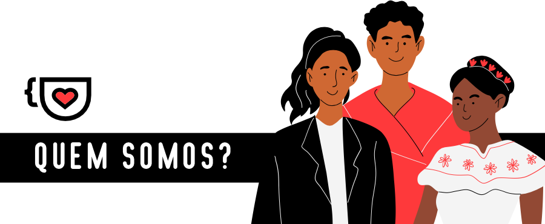

# Sobre

  

Somos uma comunidade cujo objetivo é acolher pessoas iniciantes na área de tecnologia, com foco na inclusão de grupos minoritários.

O canal Cafeína Vagas ([@CafeinaVagas](https://t.me/CafeinaVagas)) e o grupo de chat Cafeína Help ([@CafeinaVagasChat](https://t.me/CafeinaVagasChat)) é mantido por voluntários. Não recebemos nada pelo nosso trabalho e não somos associados a nenhuma empresa. 

As vagas postadas não são respondidas por nós, a não ser as vagas de edital para novos voluntários em nossos projetos.

## ☕ Como ajudar?

Você pode ajudar a comunidade compartilhando vagas para iniciantes e conteúdos gratuitos no [@CafeinaVagasBot](https://t.me/CafeinaVagasBot); respondendo dúvidas e compartilhando suas experiências no [@CafeinaVagasChat](https://t.me/CafeinaVagasChat).

## ‼️ Legenda de ações disciplinares

|Símbolo | Ações disciplinares |
|--------|---------|
| 🟡 | Silênciar |
| 🔴 | Banimento imediato |
| 🟣 | Advertência (3 advertências = banimento) |

## 🛡️ Código de conduta

1. Não toleramos discriminação de qualquer tipo (raça, gênero, religião, etc). 🔴

2. Proibido discussões sobre temas polêmicos. Digite #polemicos no chat para ler mais. 🟣

3. Não critique ou questione vagas inclusivas (direcionadas a grupos minoritários em TI). 🔴

4. Antes de chamar alguém no privado, peça permissão. 🔴
> PS: Denuncie mandando print e enviando a mensagem no [@SAC_CafeinaBot](https://t.me/SAC_CafeinaBot)

## 📝 Regras de publicação 

5.Proibido compartilhar links, vagas ou se autopromover no chat. 🟣
> Somente vagas, cursos e conteúdos 100% **gratuitos** podem ser enviados para [@CafeinaVagasBot](https://t.me/CafeinaVagasBot). 

6. Nosso bot bloqueia palavrões e termos que possam gerar conflitos ou fugir do propósito do grupo. 🟡

7. Imagens, gifs ou perfis com conteúdo impróprio ou perturbador não são permitidos. 🔴

8. Sempre mantenha os créditos ao compartilhar nosso conteúdo. 🔴

## 📢 Denunciando desrespeito as regras

Para denunciar, marque **@admin** no post a ser denunciado ou entre em contato com os canais abaixo.

## ☎️ Contato e parcerias 

Para entrar em contato conosco ou fazer parcerias, fale com [@SAC_CafeinaBot](https://t.me/SAC_CafeinaBot) no Telegram ou envie um e-mail para contato@compiladoras.com.br (no e-mail demoramos para responder).
