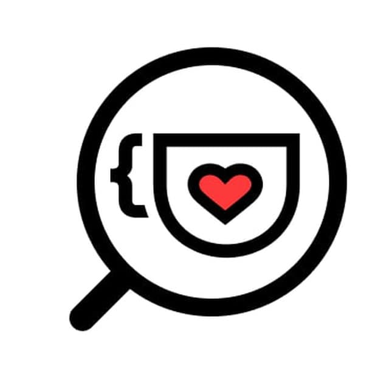

# Sobre

  

Somos uma comunidade cujo objetivo é acolher pessoas iniciantes na área de tecnologia, com foco na inclusão de grupos minoritários.

O canal Cafeína Vagas ([@CafeinaVagas](https://t.me/CafeinaVagas)) e o grupo de chat Cafeína Help ([@CafeinaVagasChat](https://t.me/CafeinaVagasChat)) é mantido por voluntários. Não recebemos nada pelo nosso trabalho e não somos associados a nenhuma empresa. 

As vagas postadas não são respondidas por nós, a não ser as vagas de edital para novos voluntários em nossos projetos.

## ☕ Como ajudar?

Você pode ajudar a comunidade compartilhando vagas para iniciantes e conteúdos gratuitos no [@CafeinaVagasBot](https://t.me/CafeinaVagasBot); respondendo dúvidas e compartilhando suas experiências no [@CafeinaVagasChat](https://t.me/CafeinaVagasChat) e também apoiando nossa causa ao doar qualquer quantia no nosso PIX: compiladoras@gmail.com

## ‼️ Legenda

|Símbolo | Punição |
|--------|---------|
| 🟡 | Silêncio (mínimo 8h) |
| 🔴 | Banimento |
| 🟡🔴 | Silêncio (primeiro aviso), banimento caso ocorra novamente |

## 🛡️ Código de conduta

1. Nós não toleramos nenhum tipo de discriminação, seja de raça, gênero, religião, etc. 🔴

2. **Seja gentil sempre!** Evite discussões que perturbem a paz do grupo e temas sensíveis como religião e política. 🟡🔴

3. Não faça uma reclamação sobre uma vaga por ela ser inclusiva (vagas inclusivas são vagas direcionadas a grupos minoritários em TI). 🔴

4. É proibido mandar **mensagem no privado** para as pessoas, exceto se a pessoa autorizar. 🔴

## 📝 Regras de publicação 

1. Não envie vagas no grupo. Envie as vagas no [@CafeinaVagasBot](https://t.me/CafeinaVagasBot) para serem avaliadas. Se estiver na proposta do canal, a vaga será postada. PS: Apenas vagas sem experiência. 🟡🔴

2. Cursos e conteúdos podem ser enviados no chat caso solicitado por um membro da comunidade. Se conhece um conteúdo bacana, compartilhe no bot [@CafeinaVagasBot](https://t.me/CafeinaVagasBot). 🟡

3. Evite falar palavrões e termos pejorativos. Nosso bot tem filtro elevado para nos proteger de bots e outros tipos de ataques. 🟡

4. Conteúdos pagos, vendas, vaquinhas e links de afiliados são proibidos. 🟡🔴

5. Imagens e conteúdos graficamente chocantes, seja em gifs ou até mesmo no nick/foto do perfil não são permitidos. 🔴

## 📢 Denunciando desrespeito as regras

Para denunciar, marque **@admin** no post a ser denunciado ou entre em contato com os canais abaixo.

## ☎️ Contato e parcerias 

Para entrar em contato conosco ou fazer parcerias, fale com [@SAC_CafeinaBot](https://t.me/SAC_CafeinaBot) no Telegram ou envie um e-mail para contato@compiladoras.com.br
